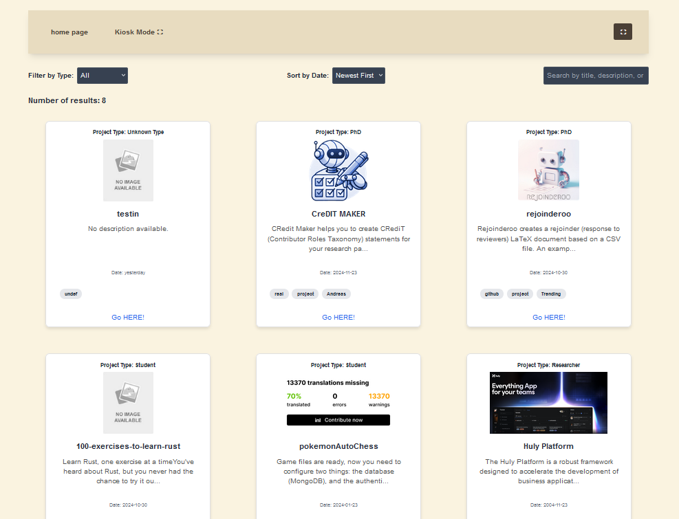

# ShowcaseSERL

ShowcaseSERL is a Next.js 14+ platform designed to showcase student and researcher-developed projects. It provides dynamic project listing, detailed views, and kiosk mode functionality for a user-friendly display on various devices.

## Introduction

The project aims to provide an easy-to-use interface for presenting research work and projects interactively. Data is managed through JSON files, making it simple to update and manage project information without requiring a complex backend.


## Prerequisites

Before you begin, ensure you have installed the following:
Node.js:(using v20.11.0) you may install from their official website https://nodejs.org/en/download/package-manager
npm: (v10.8.3) usually comes with node

If you are on linux/ubuntu, you may run this:

```bash
sudo apt update
sudo apt install nodejs npm
```

To verivy if the installation went well try:

```bash
node -v
npm -v
```

if you plan on cloning the repo, make sure to have git installed

## How to Use

1. Clone the repository:

   ```bash
   git clone https://github.com/KarmaSora/showcaseSERL.git
   cd showcaseSERL
   ```

2. Install dependencies:

   ```bash
   npm install
   ```

3. To run the project in development mode:

   ```bash
   npm run dev
   ```

   The project will be accessible at `http://localhost:3000`.

4. To use kiosk mode, navigate to `/kiosk` or `/kiosk/[id]` for a specific project.

## Build

To build the project for production:

```bash
npm run build
```

This will create an optimized production build of your Next.js application.

## Test

try to add a JSON object and wat to see if the page updates. If it does try searching for it using the search filters for tags, title and so on. Proceed to check you can access the detailed page about the research. Proceed to see if yo can view it in kiosk by entering the /kioks/[id] , make sure to replace the [id] with the actuall ID. Or just click the option for kiosk.

## Run (Production)

To run the project in production mode after building:

`` `bash
npm run start

````

## Required JSON Structure

The data for the projects is managed via a JSON file. Each object in the JSON file must contain the following attributes:

- `id`: A unique identifier for the project (string).
- `date`: The date when the project was published (YYYY-MM-DD format).
- `researchType`: Type of research (e.g., "Student" or "Researcher" or "PhD").
- `title`: The title of the project.
- `description`: A detailed description of the project.
- `tags`: An array of tags to categorize the project.
- `screenshots`: An array of image URLs related to the project (optional).
- `researchURL`: A URL pointing to the project or research details.

### Example JSON Object

```json
{
  "id": "20",
  "date": "2024-10-30",
  "researchType": "Student",
  "title": "100-exercises-to-learn-rust",
  "description": "Learn Rust, one exercise at a time. This course is for you!",
  "tags": ["github", "random", "Trending"],
  "screenshots": [],
  "researchURL": "https://github.com/mainmatter/100-exercises-to-learn-rust"
}
````

Note: you may change the time interval between research itteration in /kiosk by editing the "chosenTimerForPageIteration" veriable in kisokPage.tsx. the value is set to 6000 ms by default.

MIT License

Copyright (c) 2024 Karam Matar

Permission is hereby granted, free of charge, to any person obtaining a copy
of this software and associated documentation files (the "Software"), to deal
in the Software without restriction, including without limitation the rights
to use, copy, modify, merge, publish, distribute, sublicense, and/or sell
copies of the Software, and to permit persons to whom the Software is
furnished to do so, subject to the following conditions:

The above copyright notice and this permission notice shall be included in all
copies or substantial portions of the Software.

THE SOFTWARE IS PROVIDED "AS IS", WITHOUT WARRANTY OF ANY KIND, EXPRESS OR
IMPLIED, INCLUDING BUT NOT LIMITED TO THE WARRANTIES OF MERCHANTABILITY,
FITNESS FOR A PARTICULAR PURPOSE AND NONINFRINGEMENT. IN NO EVENT SHALL THE
AUTHORS OR COPYRIGHT HOLDERS BE LIABLE FOR ANY CLAIM, DAMAGES OR OTHER
LIABILITY, WHETHER IN AN ACTION OF CONTRACT, TORT OR OTHERWISE, ARISING FROM,
OUT OF OR IN CONNECTION WITH THE SOFTWARE OR THE USE OR OTHER DEALINGS IN THE
SOFTWARE.
